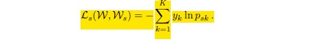

# ObjectNet

## ResNet101
Deep Residual Learning for Image Recognition [link to paper](https://arxiv.org/pdf/1512.03385.pdf)

we address the degradation problem by
introducing a deep residual learning framework. Instead
of hoping each few stacked layers directly fit a
desired underlying mapping, we explicitly let these layers
fit a residual mapping. Formally, denoting the desired
underlying mapping as **H(x)**, we let the stacked nonlinear
layers fit another mapping of **F(x) := H(x)-x**. The original
mapping is recast into **F(x)+x**. We hypothesize that it
is easier to optimize the residual mapping than to optimize
the original, unreferenced mapping. To the extreme, if an
identity mapping were optimal, it would be easier to push
the residual to zero than to fit an identity mapping by a stack
of nonlinear layers. 
In our case, the shortcut connections simply
perform identity mapping, and their outputs are added to
the outputs of the stacked layers.  
In the paper they show that:
1) Our extremely deep residual nets
are easy to optimize, but the counterpart “plain” nets (that
simply stack layers) exhibit higher training error when the
depth increases. 
2) Our deep residual nets can easily enjoy
accuracy gains from greatly increased depth, producing results
substantially better than previous networks.

Here is implementation structure they used in theirs paper

And they got this top-1 error rates:

Because we are using resnet101, residual blocks constructed over Bottleneck block. Here is the structure:

## Dilation
Dilated Residual Networks [link to paper](https://arxiv.org/pdf/1705.09914.pdf)

We show that dilated residual networks
(DRNs) outperform their non-dilated counterparts in image
classification without increasing the model’s depth or
complexity. We then study gridding artifacts introduced by
dilation, develop an approach to removing these artifacts
(‘degridding’), and show that this further increases the performance
of DRNs. In addition, we show that the accuracy
advantage of DRNs is further magnified in downstream applications
such as object localization and semantic segmentation.

While convolutional networks have done well, the almost
complete elimination of spatial acuity may be preventing
these models from achieving even higher accuracy, for
example by preserving the contribution of small and thin
objects that may be important for correctly understanding
the image.

The use of dilated convolutions can cause gridding artifacts.

So they introduced three methods to remove this artifacts. Here is the structure of them:

Here is comparison of differenet dilated resnets based on error rates

And you can see the accuracy of this model in semantic segmentation on cityscapes dataset:

A sample comparison:

## Supervision
Training Deeper Convolutional Networks with Deep Supervision [link to paper](https://arxiv.org/pdf/1505.02496.pdf)

In order to train deeper networks, we propose to
add auxiliary supervision branches after certain intermediate
layers during training. We formulate a simple rule of
thumb to determine where these branches should be added.
The resulting deeply supervised structure makes the training
much easier and also produces better classification results
on ImageNet and the recently released, larger MIT
Places dataset.

Illustration of our deep models with 8 and 13 convolutional layers. The additional supervision loss branches
are indicated by dashed red boxes. Xl denote the intermediate layer outputs and Wl are the weight matrices for each
computational block. Blocks of the same type are shown in the same color. A legend below the network diagrams shows the
internal structure of the different block types.

Loss functions:

auxiliary loss
 

Note that this loss depends on W, not just Ws, because the
computation of the feature map S8 involves the weights of
the early convolutional layers W1; : : :W4.
The combined loss function for the whole network is
given by a weighted sum of the main loss L0(W) and the
auxiliary supervision loss Ls(Ws):

where alpha-t controls the trade-off between the two terms. In
the course of training, in order to use the second term
mainly as regularization, we adopt the same strategy as
in [6], where alpha decays as a function of epoch t (with N
being the total number of epochs):

We train our deeply supervised model using stochastic
gradient descent.

Here is top-1 and top-5 accuracies on places dataset:

## Pyramid Pooling
Pyramid Scene Parsing Network [link to paper](https://arxiv.org/pdf/1612.01105.pdf)

# Reference
Repository of models [link](https://github.com/CSAILVision/sceneparsing)

Repository of pytorch implementation [link](https://github.com/hangzhaomit/semantic-segmentation-pytorch)
